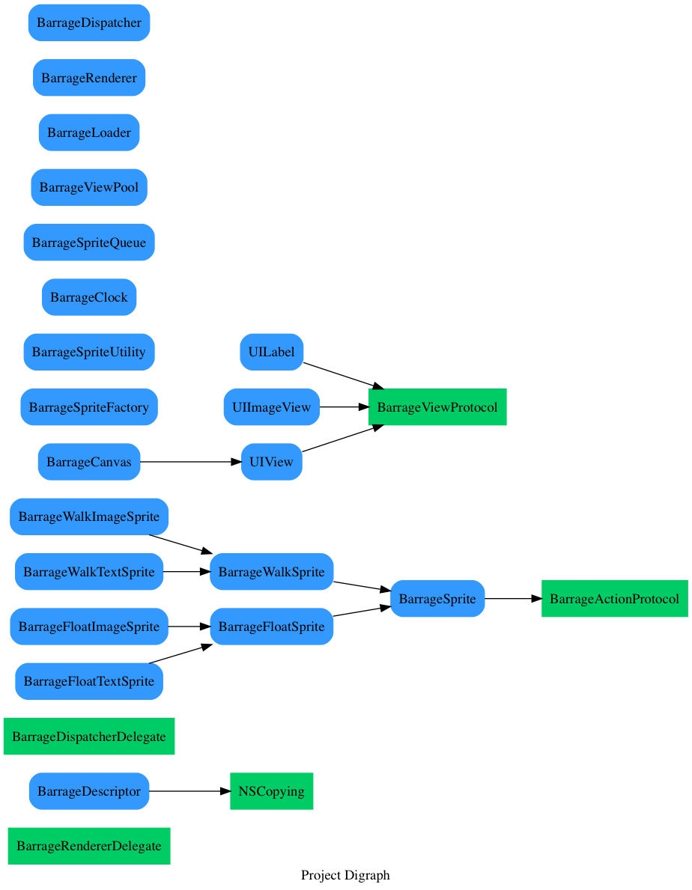

# analyze_project

一个分析项目类层级的脚本

## 功能

将特定目录下的 Objective-C 类层级可视化, 以便于分析一些开源工程. 如图:

其中, 蓝色表示类, 绿色表示协议.

箭头表示继承关系, 或者协议实现关系.

## 使用

1. Python3.0+
1. 安装依赖: pip install graphviz
1. 进入 analyze_project 根目录, 运行: python ./analyze_project.py dir1 dir2
1. 其中: dir1 表示工程文件目录, dir2 表示可视化图的输出目录.
1. 输出文件为 dir2/project.png

## 联系

如有问题, 欢迎提 issue.